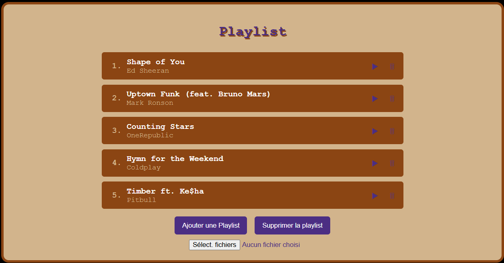
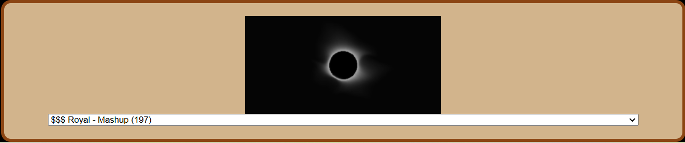

# LecteurALpha

Bienvenue dans **LecteurALpha**, un lecteur audio et visualiseur de nouvelle génération, conçu pour offrir une expérience audio-visuelle immersive et interactive.

## Fonctionnalités

- 🎵 **Lecteur Audio Avancé** : Profitez de votre musique préférée avec des contrôles intuitifs pour la lecture, la pause, l'arrêt, le volume et la stéréo.
- 🎨 **Visualiseur Butterchurn** : Transformez votre musique en une expérience visuelle époustouflante avec des visualisations dynamiques et personnalisables.
- 📜 **Playlist Interactive** : Gérez facilement vos pistes audio avec une playlist interactive, incluant des fonctionnalités de glisser-déposer, de suppression et de lecture.
- 🔊 **Contrôles Audio** : Ajustez le volume, la stéréo et la vitesse de lecture pour une expérience audio personnalisée.
- 🌐 **Web Components** : Utilisation de Web Components pour une intégration facile et une modularité accrue.
- 🎚️ **Égaliseur Audio** : Personnalisez votre expérience sonore en ajustant les bandes de fréquences (Basses, Médiums, Aigus) via un égaliseur interactif.

## Installation

1. Clonez le dépôt :

   ```bash
   git clone https://github.com/votre-utilisateur/LecteurALpha.git
   cd LecteurALpha
   ```

2. Ouvrez [index.html](http://_vscodecontentref_/0) dans votre navigateur préféré.

## Utilisation

### Lecteur Audio

- **Lecture/Pause** : Utilisez les boutons de lecture et de pause pour contrôler la musique.
- **Volume** : Ajustez le volume avec le curseur de volume.
- **Stéréo** : Modifiez la balance stéréo avec le curseur de stéréo.
- **Vitesse de Lecture** : Changez la vitesse de lecture avec les boutons de ralentissement et d'accélération.

### Playlist

- **Ajouter des chansons** : Cliquez sur "Ajouter une Playlist" pour charger des pistes audio.
- **Supprimer des chansons** : Utilisez le bouton de suppression pour retirer des pistes de la playlist.
- **Glisser-Déposer** : Réorganisez les pistes par glisser-déposer.

### Visualiseur

- **Sélection de Presets** : Choisissez parmi une variété de presets visuels pour personnaliser l'affichage.
- **Visualisation en Temps Réel** : Profitez de visualisations en temps réel synchronisées avec votre musique.

### Égaliseur

- **Bandes de Fréquences** : Ajustez les bandes de fréquences principales :
  - **Bass** (60 Hz) : Contrôle des basses fréquences.
  - **Mid** (1000 Hz) : Contrôle des fréquences moyennes.
  - **Treble** (14000 Hz) : Contrôle des hautes fréquences.
- **Interface Interactive** : Déplacez les curseurs de l'égaliseur pour modifier la qualité sonore en temps réel.

## Technologies Utilisées

- **HTML5** : Structure de la page et des composants.
- **CSS3** : Styles et animations.
- **JavaScript** : Logique de l'application et interactions.
- **Web Components** : Modularité et encapsulation des composants.
- **Butterchurn** : Visualisations audio dynamiques.

## Captures d'Écran






---

Profitez de votre musique avec **LecteurALpha** et laissez-vous emporter par des visualisations spectaculaires !
